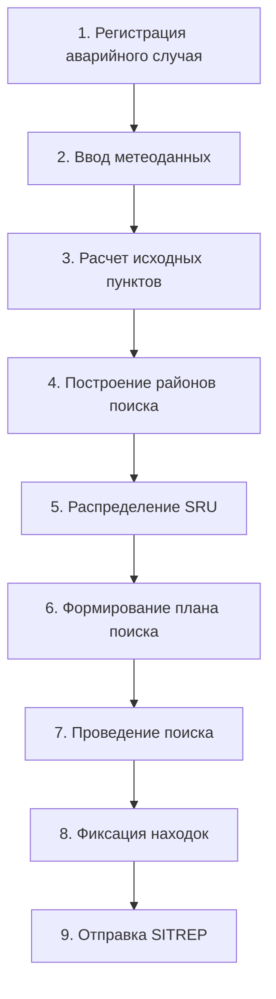

# 📘 РУКОВОДСТВО ПОЛЬЗОВАТЕЛЯ
# СИСТЕМА "ПОИСК-МОРЕ. РАСЧЕТНЫЙ БЛОК"

## ОГЛАВЛЕНИЕ

1. [О СИСТЕМЕ](#1-о-системе)
2. [НАЧАЛО РАБОТЫ](#2-начало-работы)
3. [ИНТЕРФЕЙС СИСТЕМЫ](#3-интерфейс-системы)
4. [РЕГИСТРАЦИЯ АВАРИЙНОГО СЛУЧАЯ](#4-регистрация-аварийного-случая)
5. [РАСЧЕТ ИСХОДНЫХ ПУНКТОВ](#5-расчет-исходных-пунктов)
6. [РАСЧЕТ РАЙОНОВ ПОИСКА](#6-расчет-районов-поиска)
7. [ФОРМИРОВАНИЕ ДОКУМЕНТОВ](#7-формирование-документов)
8. [РАБОТА С КАРТОЙ](#8-работа-с-картой)
9. [РЕЖИМЫ ИНТЕРФЕЙСА](#9-режимы-интерфейса)

---

## 1. О СИСТЕМЕ

### 1.1 Назначение
Система **"Поиск-Море. Расчетный блок"** предназначена для автоматизации расчетов при планировании и проведении поисково-спасательных операций на море в соответствии с требованиями IAMSAR.

### 1.2 Основные возможности
- Регистрация данных об аварийных случаях
- Расчет исходных пунктов поиска с учетом дрейфа
- Построение районов поиска различными методами
- Формирование плана поиска и SITREP
- Учет метеорологических условий
- Фиксация находок в ходе операции

---

## 2. НАЧАЛО РАБОТЫ

### 2.1 Запуск системы

1. **Откройте QGIS**
2. **Активируйте плагин:**
   - Меню **Модули** → **Управление модулями**
   - Найдите **"Поиск-Море. Расчетный блок"**
   - Поставьте галочку для активации

### 2.2 Первоначальная настройка

После активации плагина в интерфейсе QGIS появятся:
- **Главное меню "ПОИСК-МОРЕ"** в строке меню
- **Боковая панель навигации** слева
- **Вкладка "Операция"** (после регистрации случая)

### 2.3 Предварительные операции

Перед началом работы с системой рекомендуется:

#### Настроить список аварийных ситуаций:
1. Откройте меню **ПОИСК-МОРЕ** → **Сервис** → **Характер аварийной ситуации**
2. Добавьте, отредактируйте или удалите типы ситуаций
3. Нажмите **"Сохранить"**

#### Проверить авторизацию (при наличии сервера):
1. **Сервис** → **Авторизация**
2. Введите логин и пароль
3. Подтвердите подключение

---

## 3. ИНТЕРФЕЙС СИСТЕМЫ

### 3.1 Структура главного меню

```
ПОИСК-МОРЕ
├── Поиск
│   ├── Новый аварийный случай
│   ├── Повторный поиск
│   ├── Дела и поисковые операции
│   ├── Редактировать информацию
│   ├── Завершить операцию
│   └── Закрыть поиск
│
├── Сервис
│   ├── Характер аварийной ситуации
│   ├── Авторизация
│   ├── Синхронизация адресной книги
│   └── Интерфейс (режимы работы)
│
├── Исходный пункт (доступно после регистрации)
│   ├── Вычислить исходные пункты
│   └── Исходная линия
│
├── Район (доступно после расчета исходных пунктов)
│   ├── Создать район
│   │   ├── Поиск от двух исходных пунктов
│   │   ├── Поиск от исходной точки
│   │   ├── Поиск в далеко разнесенных районах
│   │   ├── Поиск от линии между пунктами
│   │   └── Поиск вдоль исходной линии
│   └── Ручное построение района
│
├── Документы
│   ├── Стандартные формы
│   ├── План поиска
│   └── Отправить SITREP
│
└── Помощь
    └── Справочник IAMSAR
```

### 3.2 Боковая панель навигации

Панель "Поиск-Море — Навигация" содержит:
- **Картографическая основа**: выбор базовой карты
- **Тематические слои**: управление отображением слоев
- **Районы МСКЦ/МСПЦ**: быстрый переход к районам

### 3.3 Вкладка "Операция"

Появляется после регистрации аварийного случая и содержит:
- Краткие сведения о текущей операции
- Найденные предметы (thing1, thing2, thing3)
- Информация о находках
- Кнопка "Печать" для вывода данных

---

## 4. РЕГИСТРАЦИЯ АВАРИЙНОГО СЛУЧАЯ

### 4.1 Создание нового дела

Для регистрации аварийного случая:

1. Откройте меню **ПОИСК-МОРЕ** → **Поиск** → **"Новый аварийный случай"**

2. Заполните вкладки в форме регистрации:

#### Вкладка "Объект аварийного случая/Местоположение"
- **Название**: наименование судна или объекта
- **Тип объекта**: выберите из списка
- **Координаты LKP** (последнее известное местоположение)
- **Дата и время происшествия**
- **Район поиска**: выберите МСКЦ/МСПЦ

#### Вкладка "Объекты поиска"
- Количество людей в опасности
- Тип плавсредства
- Наличие спасательных средств

#### Вкладка "Дополнительная информация"
- Описание ситуации
- Источник информации
- Контактные данные

#### Вкладка "Погода"
- **Ветер**: направление и скорость
- **Течение**: направление и скорость  
- **Волнение**: высота волн
- **Видимость**: в морских милях

3. **Сохраните данные:**
   - Нажмите кнопку **"Сохранить"**
   - Система автоматически присвоит номер дела
   - Для внутренней нумерации используйте поля "доп" и "название"

4. **После сохранения:**
   - На главной форме появится вкладка **"Операция"**
   - В меню станут доступны пункты **"Исходный пункт"** и **"Район"**
   - На карте отобразится точка LKP

### 4.2 Печать регистрационных данных

Для вывода на печать:
1. Нажмите кнопку **"Печать"** в форме регистрации
2. Данные будут выведены в формате PDF
3. Сохраните или распечатайте документ

---

## 5. РАСЧЕТ ИСХОДНЫХ ПУНКТОВ

### 5.1 Расчет при известной точке аварии

1. Откройте меню **ПОИСК-МОРЕ** → **Исходный пункт** → **"Вычислить исходные пункты"**

2. Система автоматически рассчитает:
   - Суммарный дрейф от ветра
   - Суммарный дрейф от течения
   - Два исходных пункта с учетом погрешностей

3. **Результат:**
   - На карте появятся исходные пункты
   - Отобразятся линии дрейфа
   - Данные сохранятся в операции

### 5.2 Расчет при аварии на маршруте

1. Откройте **Исходный пункт** → **"Исходная линия"**

2. Введите:
   - Координаты последней известной точки на маршруте
   - Время прохождения точки
   - Планируемое время прибытия

3. Нажмите **"Рассчитать"**

4. **Результат:**
   - На карте появится часть маршрута, где могла произойти авария
   - Исходная линия для дальнейших расчетов

---

## 6. РАСЧЕТ РАЙОНОВ ПОИСКА

### 6.1 Выбор метода построения

В зависимости от ситуации выберите один из методов:

#### Для аварии в известной точке:
- **Поиск от двух исходных пунктов** (основной метод)
- **Поиск от исходной точки**

#### При далеко разнесенных исходных пунктах:
- **Поиск от линии между пунктами**
- **Поиск в отдельных районах**

#### Для аварии на маршруте:
- **Поиск вдоль исходной линии**

### 6.2 Поиск от двух исходных пунктов

1. Откройте **ПОИСК-МОРЕ** → **Район** → **Создать район** → **"Поиск от двух исходных пунктов"**

2. В открывшейся форме укажите:
   - **Параметры поиска:**
     - Скорость поиска (узлы)
     - Дистанция между галсами
     - Коэффициент покрытия
   
   - **Доступные SRU (поисково-спасательные единицы):**
     - Добавьте суда/вертолеты
     - Укажите их характеристики
     - Назначьте районы

3. Нажмите **"Построить район"**

4. **Результат:**
   - На карте появится район поиска
   - Район будет разделен на подрайоны для SRU
   - Рассчитаются оптимальные маршруты

### 6.3 Ручное построение района

1. **Район** → **"Ручное построение района"**

2. Нажмите на карте для задания углов района

3. Завершите построение двойным щелчком

4. Введите параметры района в появившейся форме

---

## 7. ФОРМИРОВАНИЕ ДОКУМЕНТОВ

### 7.1 План поиска

1. Откройте **ПОИСК-МОРЕ** → **Документы** → **"План поиска"**

2. Система автоматически сформирует план, включающий:
   - Данные об аварии
   - Метеоусловия
   - Расчетные исходные пункты
   - Районы поиска
   - Распределение SRU
   - Схемы поиска

3. Выберите вариант плана и нажмите **"Сохранить"**

**ВАЖНО:** После отправки выбранного варианта плана внести изменения будет невозможно!

### 7.2 Отправка SITREP

1. **Документы** → **"Отправить SITREP"**

2. Заполните форму ситуационного донесения

3. Выберите адресатов из адресной книги

4. Нажмите **"Отправить"**

### 7.3 Стандартные формы

Система автоматически формирует стандартные формы в соответствии с IAMSAR:
- Форма регистрации аварийного случая
- Расчетные листы
- Таблицы распределения сил
- Отчеты о результатах поиска

---

## 8. РАБОТА С КАРТОЙ

### 8.1 Отображение элементов

На карте отображаются:
- **LKP** - последнее известное местоположение (красная точка)
- **Исходные пункты** - желтые круги
- **Линии дрейфа** - пунктирные линии
- **Районы поиска** - заштрихованные области
- **Подрайоны SRU** - пронумерованные секторы
- **Находки** (thing1, thing2, thing3) - отмеченные точки

### 8.2 Управление отображением

Используйте боковую панель для:
- Включения/выключения слоев
- Изменения прозрачности
- Применения стилей
- Переключения базовых карт

### 8.3 Фиксация находок

На вкладке **"Операция"**:

1. Нажмите кнопку добавления находки

2. Укажите на карте местоположение

3. Заполните описание:
   - Тип находки
   - Время обнаружения  
   - Координаты
   - Описание
   - Фотографии (сохраняйте в отдельной папке)

4. Сохраните информацию

---

## 9. РЕЖИМЫ ИНТЕРФЕЙСА

### 9.1 Переключение режимов

Система поддерживает три режима работы:

#### Минимальный режим
Для операторов САР - только необходимые функции:
- Меню системы "Поиск-Море"
- Карта
- Управление модулями

**Включение:** **Сервис** → **Интерфейс** → **"Минимальный интерфейс"**

#### Упрощенный режим
Для аналитиков - базовые функции QGIS:
- Функции системы + основные инструменты
- Скрыты сложные панели редактирования

**Включение:** **Сервис** → **Интерфейс** → **"Включить упрощенный режим"**

#### Полный интерфейс
Для ГИС-специалистов - все возможности:
- Полный функционал QGIS
- Все панели и инструменты

**Восстановление:** **Сервис** → **Интерфейс** → **"Восстановить полный интерфейс"**

---

## ПОСЛЕДОВАТЕЛЬНОСТЬ РАБОТЫ

### Стандартный порядок действий при поисковой операции:



### Контрольный список действий:

- [ ] Зарегистрировать данные по аварии
- [ ] Ввести метеорологические условия
- [ ] Произвести расчет исходных пунктов
- [ ] Построить районы поиска
- [ ] Распределить поисково-спасательные единицы
- [ ] Сформировать план поиска
- [ ] Зафиксировать находки (при обнаружении)
- [ ] Отправить ситуационное донесение

---

## ГОРЯЧИЕ КЛАВИШИ

| Действие | Клавиши |
|----------|---------|
| Новый аварийный случай | `Ctrl+N` |
| Открыть список операций | `Ctrl+O` |
| Редактировать информацию | `Ctrl+E` |
| Сохранить | `Ctrl+S` |
| Печать | `Ctrl+P` |
| Переключить режим интерфейса | `F11` |

---

## РЕШЕНИЕ ПРОБЛЕМ

### Не появляется меню после активации плагина
- Перезапустите QGIS
- Проверьте версию QGIS (требуется 3.16+)
- Откройте Консоль Python и проверьте ошибки

### Не рассчитываются исходные пункты
- Проверьте заполнение всех обязательных полей
- Убедитесь, что введены метеоданные
- Проверьте корректность координат LKP

### Не строится район поиска
- Сначала должны быть рассчитаны исходные пункты
- Проверьте параметры поиска (скорость, дистанция)
- Убедитесь, что добавлены SRU

### Ошибка при формировании документов
- Проверьте полноту введенных данных
- Сохраните операцию перед формированием
- Проверьте наличие шаблонов в папке плагина

---

## ТЕХНИЧЕСКАЯ ПОДДЕРЖКА

**Email:** support@msrcc.ru  
**Телефон:** (указать телефон МСКЦ)  
**Версия системы:** 1.0.0 (Расчетный блок)  
**Разработчик:** МСКЦ

---

## ПРИЛОЖЕНИЯ

### А. Сокращения
- **SAR** - Search and Rescue (Поиск и спасание)
- **SRU** - Search and Rescue Unit (Поисково-спасательная единица)
- **LKP** - Last Known Position (Последнее известное местоположение)
- **SITREP** - Situation Report (Ситуационное донесение)
- **МСКЦ** - Морской спасательно-координационный центр
- **МСПЦ** - Морской спасательный подцентр

### Б. Ссылки на документы
- Руководство IAMSAR (том II)
- Методика проведения поисково-спасательных операций
- Инструкции по заполнению форм

---

*Система "Поиск-Море. Расчетный блок" - надежный инструмент для планирования и координации поисково-спасательных операций на море.*
